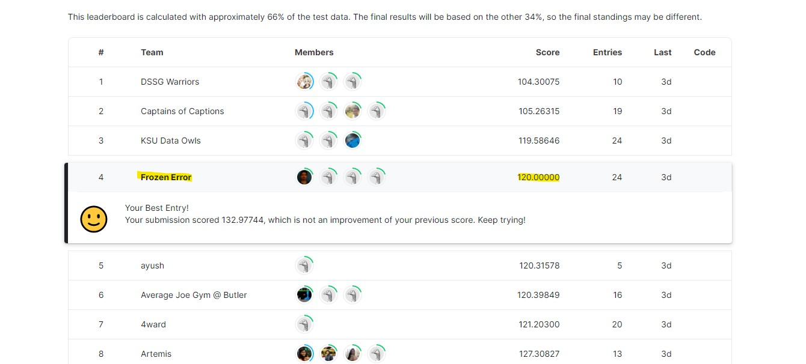

# Image Captioning for Hausa, Kyrgyz and Thai Languages

This competition was organised by Purdue University to caption images in three different languages. 

The goal of this competition was to automatically caption images in three different languages:

- Hausa (spoken by 77M people in Nigeria, Burkina Faso, Niger),
- Kyrgyz (spoken by 5M people in Afghanistan, China, Kyrgyzstan and Tajikistan), and
- Thai (spoken by 61M people in Thailand and Cambodia)

The link to the Kaggle Competition : https://www.kaggle.com/competitions/purdue-data-for-good

## 💾 Data for the Competition

The dataset originates from [**Bloom Library**](https://bloomlibrary.org/). The dataset consists of images talken from this book library with one caption per image (either in Hausa, Kyrgyz or Thai language). The dataset is hosted on [**Hugging Face**](https://huggingface.co/datasets/sil-ai/bloom-captioning). We were to use this image, captions pairs and train an Image Captioning model to caption the images in the said languages.

## Our Approach (yes our, we worked in a Team of 4)

Our approach to solving the problem was to create three different models (one for each language) and then generate predictions based on the language which we wanted the caption in. To create the models, we used **Show, Attend and Tell** model architecture for Image Captioning, which uses **Attention** along with `CNN` layers and `LSTM` layers to learn captions. I previously have worked on `image captioning task` before, but it was just with `english` language, so I already had the code ready for the task, we just had to clean the data and feed it the right way to the layers to train the model. The base code that we used to train each language model is [**here**](https://github.com/vatsalmpatel/Image-Captioning-with-PyTorch-and-Attention-Networks). This code is written in `PyTorch`.

Some basic data cleaning was required because the dataset captions contained a lot of new line (`\n`) characters and some characters which would not have helped the model to learn meaningful captions. So we cleaned the data and feed the data too the model for it to train on.

The model reasonably well when trained on the base dataset. But the problem with the base dataset was that there were not many images and captions in the dataset, which means the dataset was very small in size (less that 4000 iages for each language). So what we did was we took the captions in all those three different languages, converted them to english using the `Google Translate API` and took additional images and captions from the same dataset (yes the dataset has data in many different languages), combined the data from those three languages with the English and trained a single image capotioning model. This model performed slightly better than the individual language models.

We used both `resnet101` and the `InceptionV3` model for learning the image feature. 

For sumbmission, what we did was, we generated predictions using the individual language models, and generated a CSV file on the given test dataset. This submissio contained a lot of missing captions (garbage captions) for multiple different languages, so we used the English model to generate captions in target language and fill in those missing captions. 

## 🎇 Result

We were on top of the leader board for a couple of days, but at the end we ranked `4th` on the public leaderboard scoring `120` (the lower the score the better). We are the team `Frozen Error` in the image below.

## What could have been done better ❓

Image captioning is not an easy task for the languages you don't know. We wanted to add even more data to train the model on. But adding more data would have meant more complex model to accompny that huge data, which would have increased the training time significantly, so we wanted to try that approach as well. We also wanted to try different Image Feature extraction architectures other than `resnet` and `InceptionV3`. Other than that, we need to see other approaches on what the top three teams did in their solutions to see that approach they have taken to solve the problem.